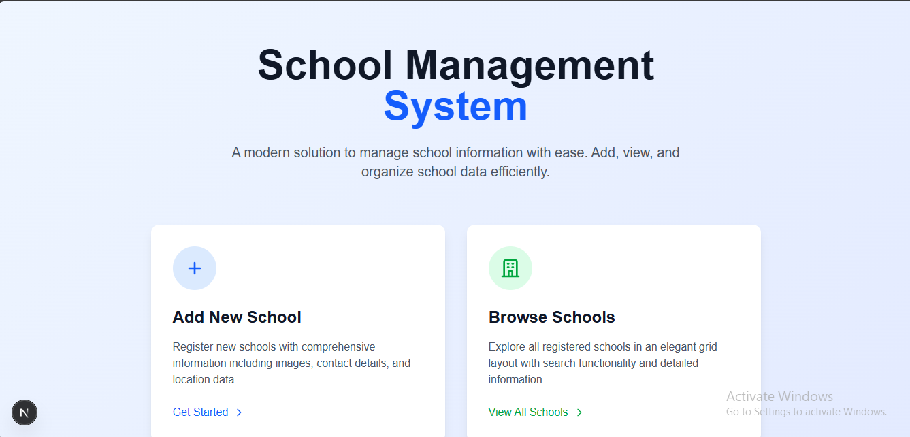
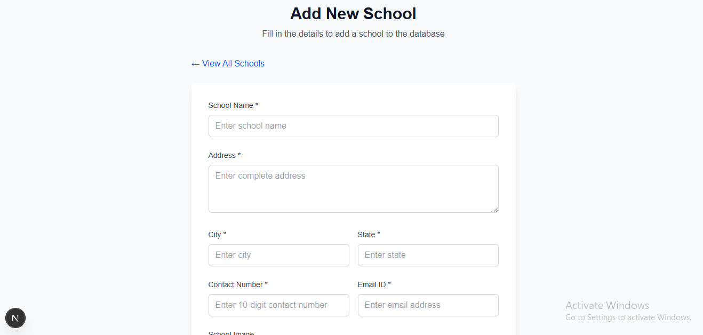
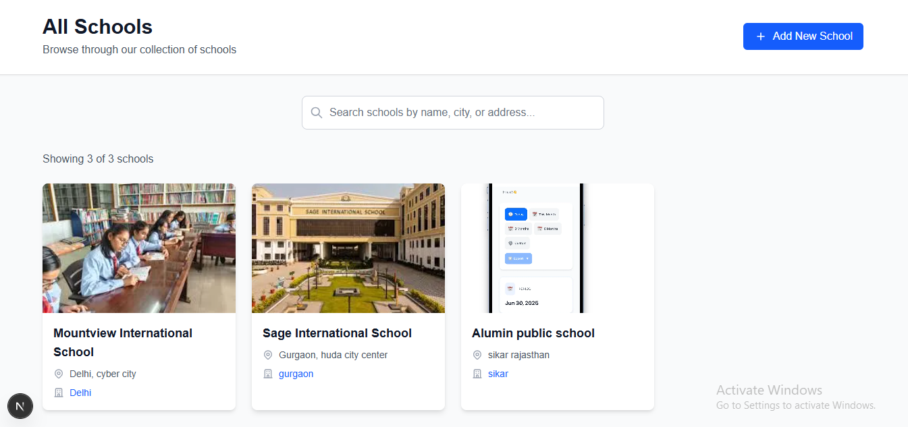
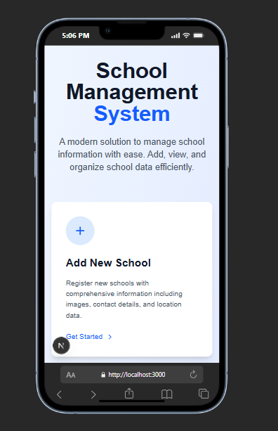
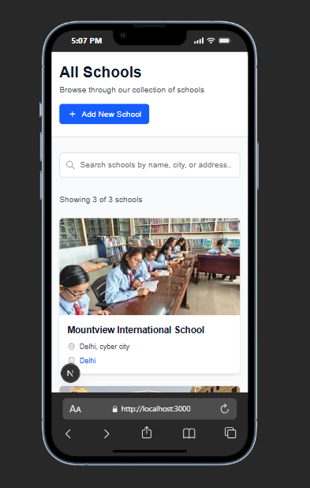

# School Management System

A full-stack web application for managing school information with CRUD operations, built using Next.js and MySQL.

## Project Overview

This project demonstrates a complete school management system where users can add new schools through a validated form and view all schools in a searchable, responsive grid layout. The application includes image upload functionality and proper database integration.

## Features

- **Add School**: Complete form with validation for adding new schools
- **View Schools**: Display all schools in a responsive grid layout
- **Search Functionality**: Real-time search by school name, city, or address
- **Image Upload**: Upload and display school images
- **Form Validation**: Client-side validation using React Hook Form
- **Responsive Design**: Works on desktop, tablet, and mobile devices

## Technology Stack

- **Frontend**: Next.js, React, Tailwind CSS
- **Backend**: Next.js API Routes
- **Database**: MySQL
- **Form Handling**: React Hook Form
- **File Upload**: Multer
- **Styling**: Tailwind CSS

## Installation & Setup

### Prerequisites
- Node.js (v16 or higher)
- MySQL database

### 1. Clone and Install
```bash
git clone <repository-url>
cd school-management-system
npm install
```

### 2. Environment Configuration
Create `.env.local` file:
```env
MYSQL_HOST=localhost
MYSQL_PORT=3306
MYSQL_USER=root
MYSQL_PASSWORD=your_root_password_here
MYSQL_DATABASE=schools_db
MYSQL_CONNECTION_LIMIT=10
```

### 3. Database Setup
```sql
CREATE DATABASE school_db;
USE school_db;

CREATE TABLE schools (
  id INT AUTO_INCREMENT PRIMARY KEY,
  name VARCHAR(255) NOT NULL,
  address TEXT NOT NULL,
  city VARCHAR(100) NOT NULL,
  state VARCHAR(100) NOT NULL,
  contact BIGINT NOT NULL,
  image VARCHAR(500),
  email_id VARCHAR(255) NOT NULL,
  created_at TIMESTAMP DEFAULT CURRENT_TIMESTAMP
);
```

### 4. Create Upload Directory
```bash
mkdir public/schoolImages
```

### 5. Run Application
```bash
npm run dev
```
Application will run on `http://localhost:3000`

## Project Structure

```
├── pages/
│   ├── api/schools.js        # API endpoints for CRUD operations
│   ├── addSchool.jsx         # Add school form page
│   ├── showSchools.jsx       # Display schools page
│   └── index.js              # Homepage
├── lib/
│   └── db.js                 # Database connection configuration
├── styles/
│   └── globals.css           # Global styles and Tailwind imports
├── public/
│   └── schoolImages/         # Directory for uploaded school images
└── .env.local                # Environment variables
```

## API Endpoints

| Method | Endpoint | Description |
|--------|----------|-------------|
| POST | `/api/schools` | Add a new school |
| GET | `/api/schools` | Retrieve all schools |

## Features Implemented

### 1. Add School Form (`/addSchool`)
- Form validation with React Hook Form
- Required fields: name, address, city, state, contact, email
- Optional image upload
- Success/error feedback

### 2. View Schools (`/showSchools`)
- Responsive grid display
- Search functionality
- Image display with fallback
- Clean card-based design

### 3. Database Integration
- MySQL database with proper schema
- Environment-based configuration
- Connection pooling for performance

## Form Validation Rules

- **School Name**: Minimum 2 characters
- **Address**: Minimum 10 characters
- **City/State**: Minimum 2 characters each
- **Contact**: Exactly 10 digits
- **Email**: Valid email format
- **Image**: Optional, supports JPG/PNG/GIF

## Key Learning Outcomes

- Full-stack development with Next.js
- Database integration and CRUD operations
- Form handling and validation
- File upload implementation
- Responsive web design
- API development and consumption

## Challenges Solved

- **File Upload**: Implemented multer for handling multipart form data
- **Database Integration**: Configured MySQL connection pool for efficiency
- **Form Validation**: Used React Hook Form for client-side validation
- **Responsive Design**: Created mobile-friendly interface with Tailwind CSS

## Future Enhancements

- User authentication and authorization
- Edit and delete functionality for schools
- Advanced search filters
- Data export features
- Dashboard with analytics

## Screenshots

*(Add screenshots of your application here)*

- Homepage
- Add School Form
- Schools Display Page
- Search Functionality

---

Screenshots :  

### 1. Homepage


### 2. Add School Form


### 3. Schools Display Page


### 4. Mobile Responsive View


